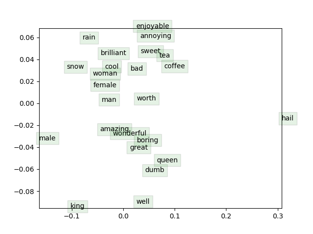

# 1  Written: Understanding word2vec (23 points)

[Answers in LaTex](./a2_written.tex)

[Answers in PDF](./a2_written.pdf)

# 2  Coding: Implementing word2vec (20 points)
## (a)  (12 points) We will start by implementing methods in `word2vec.py`.  First, implement the `sigmoid` method, which takes in a vector and applies the sigmoid function to it.  Then implement the softmaxloss and gradient in the `naiveSoftmaxLossAndGradient` method, and negative sampling loss andgradient in the `negSamplingLossAndGradient` method.  Finally, fill in the implementation for theskip-gram model in theskipgrammethod.  When you are done, test your implementation by running `python word2vec.py`.

```
==== Gradient check for skip-gram with naiveSoftmaxLossAndGradient ====
Gradient check passed!
==== Gradient check for skip-gram with negSamplingLossAndGradient ====
Gradient check passed!

=== Results ===
Skip-Gram with naiveSoftmaxLossAndGradient
Your Result:
Loss: 11.16610900153398
Gradient wrt Center Vectors (dJ/dV):
 [[ 0.          0.          0.        ]
 [ 0.          0.          0.        ]
 [-1.26947339 -1.36873189  2.45158957]
 [ 0.          0.          0.        ]
 [ 0.          0.          0.        ]]
Gradient wrt Outside Vectors (dJ/dU):
 [[-0.41045956  0.18834851  1.43272264]
 [ 0.38202831 -0.17530219 -1.33348241]
 [ 0.07009355 -0.03216399 -0.24466386]
 [ 0.09472154 -0.04346509 -0.33062865]
 [-0.13638384  0.06258276  0.47605228]]

Expected Result: Value should approximate these:
Loss: 11.16610900153398
Gradient wrt Center Vectors (dJ/dV):
 [[ 0.          0.          0.        ]
 [ 0.          0.          0.        ]
 [-1.26947339 -1.36873189  2.45158957]
 [ 0.          0.          0.        ]
 [ 0.          0.          0.        ]]
Gradient wrt Outside Vectors (dJ/dU):
 [[-0.41045956  0.18834851  1.43272264]
 [ 0.38202831 -0.17530219 -1.33348241]
 [ 0.07009355 -0.03216399 -0.24466386]
 [ 0.09472154 -0.04346509 -0.33062865]
 [-0.13638384  0.06258276  0.47605228]]

Skip-Gram with negSamplingLossAndGradient
Your Result:
Loss: 16.15119285363322
Gradient wrt Center Vectors (dJ/dV):
 [[ 0.          0.          0.        ]
 [ 0.          0.          0.        ]
 [-4.54650789 -1.85942252  0.76397441]
 [ 0.          0.          0.        ]
 [ 0.          0.          0.        ]]
 Gradient wrt Outside Vectors (dJ/dU):
 [[-0.69148188  0.31730185  2.41364029]
 [-0.22716495  0.10423969  0.79292674]
 [-0.45528438  0.20891737  1.58918512]
 [-0.31602611  0.14501561  1.10309954]
 [-0.80620296  0.36994417  2.81407799]]

Expected Result: Value should approximate these:
Loss: 16.15119285363322
Gradient wrt Center Vectors (dJ/dV):
 [[ 0.          0.          0.        ]
 [ 0.          0.          0.        ]
 [-4.54650789 -1.85942252  0.76397441]
 [ 0.          0.          0.        ]
 [ 0.          0.          0.        ]]
 Gradient wrt Outside Vectors (dJ/dU):
 [[-0.69148188  0.31730185  2.41364029]
 [-0.22716495  0.10423969  0.79292674]
 [-0.45528438  0.20891737  1.58918512]
 [-0.31602611  0.14501561  1.10309954]
 [-0.80620296  0.36994417  2.81407799]]
 ```
## (b) (4 points) Complete the implementation for your SGD optimizer in the `sgd` method of `sgd.py`.  Test your implementation by running `python sgd.py`.
 ```
Running sanity checks...
iter 100: 0.004578
iter 200: 0.004353
iter 300: 0.004136
iter 400: 0.003929
iter 500: 0.003733
iter 600: 0.003546
iter 700: 0.003369
iter 800: 0.003200
iter 900: 0.003040
iter 1000: 0.002888
test 1 result: 8.414836786079764e-10
iter 100: 0.000000
iter 200: 0.000000
iter 300: 0.000000
iter 400: 0.000000
iter 500: 0.000000
iter 600: 0.000000
iter 700: 0.000000
iter 800: 0.000000
iter 900: 0.000000
iter 1000: 0.000000
test 2 result: 0.0
iter 100: 0.041205
iter 200: 0.039181
iter 300: 0.037222
iter 400: 0.035361
iter 500: 0.033593
iter 600: 0.031913
iter 700: 0.030318
iter 800: 0.028802
iter 900: 0.027362
iter 1000: 0.025994
test 3 result: -2.524451035823933e-09
----------------------------------------
ALL TESTS PASSED
----------------------------------------
```
## (c) (4 points) Show time!  Now we are going to load some real data and train word vectors with everything you just implemented!  We are going to use the Stanford Sentiment Treebank (SST) dataset to train wordvectors, and later apply them to a simple sentiment analysis task.  You will need to fetch the datasets first.  To do this, run sh `getdatasets.sh`.  There is no additional code to write for this part; just run `python run.py`.
